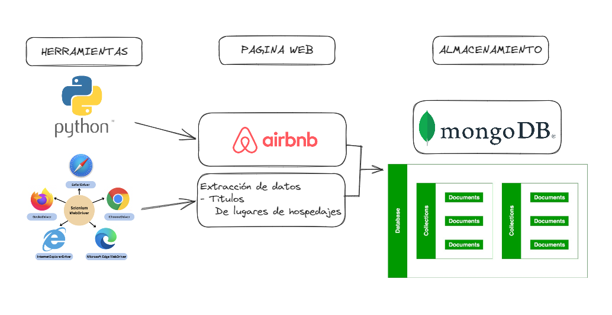
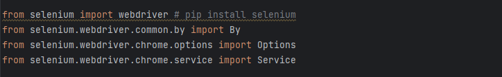
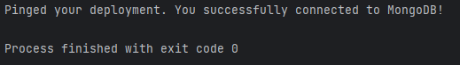
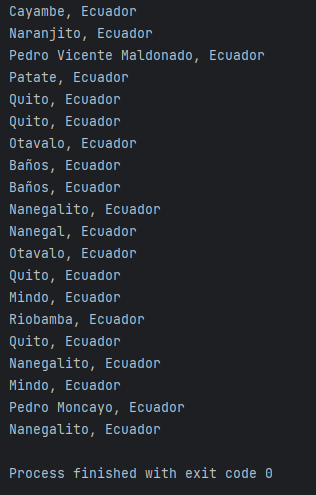
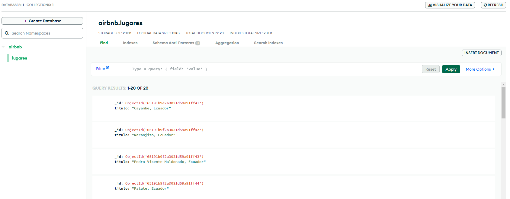

# ProyectoScrapingTD

Proyecto final de la clase de Tratamiento de Datos - Maestría Ciberseguridad 

En este proyecto extraeremos datos de la plataforma Airbnb Ecuador. 



> __Diseño elavarado en:__ https://excalidraw.com/#json=y0pajNbJGXYA5XaiuLLP3,Ta_NUCa69Fa0ko6vRoeqVw

### ¿Qué es Scraping?

El web scraping es un conjunto de prácticas utilizadas para extraer automáticamente — o `«scrapear»` — datos de la web.
# Explicación del proceso de Scraping 

### ¿Qué necesitaremos? 

Para este tipo de procesos necesitaremos.

| Programas | Enlace                                                      |
|-----------|-------------------------------------------------------------|
| PyCharm   | https://www.jetbrains.com/pycharm/download/?section=windows |
| MongoDB   | https://account.mongodb.com/account/login                   |
| Anaconda  | https://www.anaconda.com/download                           |

### Paso: 1

Utilizando Pycharm crearemos un nuevo proyectyo en `.py` 

En nuestro archivo principal del proyecto debemos improtar las siguientes librerias a utilizar.

import `.selenium`

import `.webdriver-manager`

En caso de no tener instalada dichas librerias, podríamos ejecutar en la terminal la instalación 

```commandline

py -m pip install selenium
py -m pip install webdriver-manager

```

### Paso: 2
Utilizar Chrome para abrir la página para la extracción de datos

```commandline
from webdriver_manager.chrome import ChromeDriverManager 
driver = webdriver.Chrome
```
### Paso: 3

Determinamos la URL de la web a realizar la extracción de datos

```commandline
driver.get('https://www.airbnb.com/')
```

### Paso: 4

En esta ocasión vamos a extraer los títulos de los sitios recomendados dentro de Airbnb.


### Paso: 5

Utilizaremos MongoDB como base de datos para almacenar los datos obtenidos. 

Crearemos la conexión a la base de datos mediante el método de driver. 

```commandline

from pymongo.mongo_client import MongoClient 

```
Más la cadena de conexión que nos brinde MongoDB 

### Paso: 6

Si ejecutamos el archivo `mongodb.py` debería establecer la conexión exitosamente. 



### Paso: 7

En el codigo del archivo `ScrapingAirbnbTD.py` mediante la libreria selenium webdriver extraemos los titulos de las ciudades donde Airbnb tiene cobertura. 

```commandline

titulos_anuncios = driver.find_elements(By.XPATH, '//div[@data-testid="listing-card-title"]')
for titulo in titulos_anuncios:

```



### Paso: 8

Importando la cadena de conexión que se encuentra en `mongo.py`

```commandline

from mongodb import MongoConnection
db_client = MongoConnection().client

```
Creamos la base de datos con su collection 

```commandline
db = db_client.get_database('airbnb')
col = db.get_collection('lugares')
```
Para finalmente insertar los datos extraidos previamente. 

```commandline
for titulo in titulos_anuncios:
    document = {
        "titulo": titulo.text
    }
    col.insert_one(document=document)
```

Como podremos observar acontinuación tendremos los datos extraidos insertados en una collection de una base de datos de MongoDB

